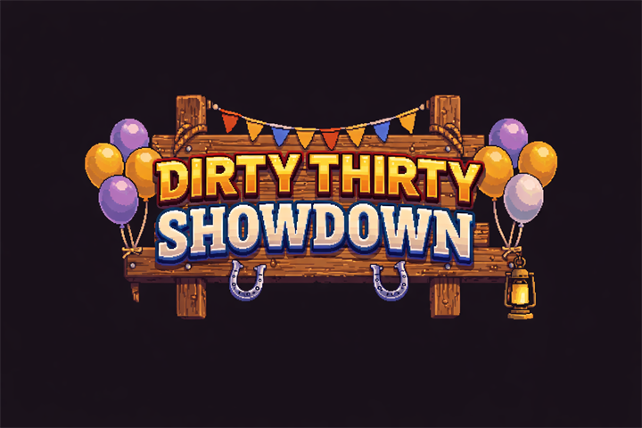
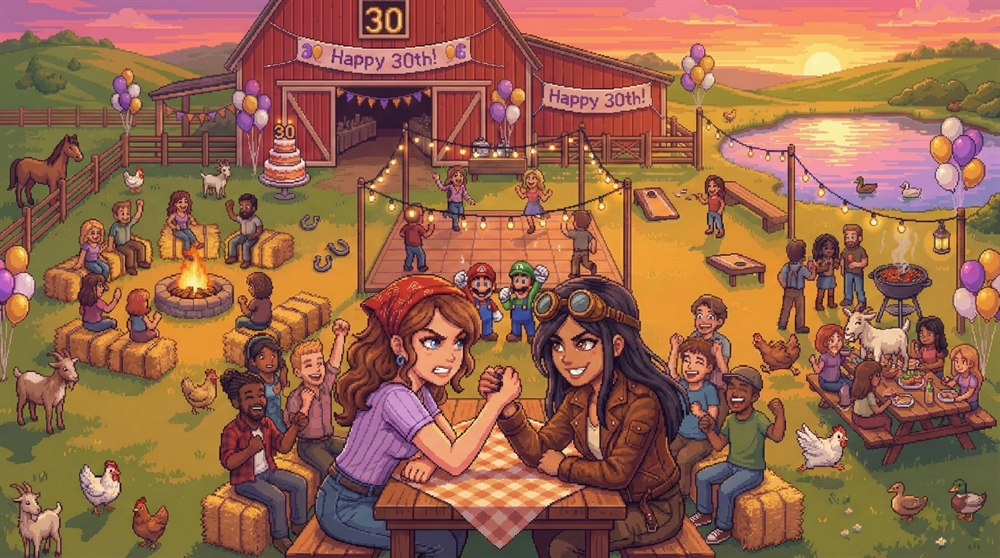
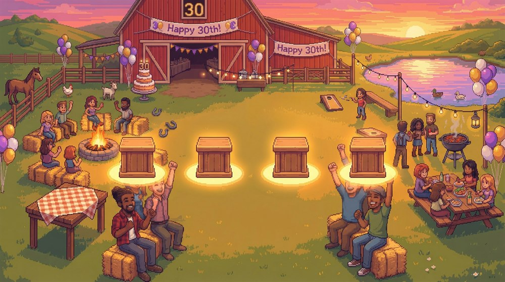

**A 2-player local arm-wrestling party game.**
Mash buttons, spam abilities, humiliate your friend. Built in Unity 6 for a 30th birthday party.

---

## How it works

Two players share one keyboard and hammer alternating keys to drag the bar to their side. Each character
brings two abilities that bend the rules — double power, frozen buttons, reversed controls, a cake to the face.

- **Best of 3** rounds, **45 seconds** each
- Push the bar all the way to your side to win the round
- If the timer runs out, whoever has the bar on their side takes it

## Characters

| | Ability 1 | Ability 2 | Playstyle |
|---|---|---|---|
| **Eli** — Birthday Wish | **Power Surge** — 2× mash power for 3s | **Flash** — blind and shake their screen | Raw aggression |
| **Lene** — Party Master | **Trash Talk** — slow them by 25% | **Shield** — block the next ability aimed at you | Defense and mind games |
| **Nati** — Dance Queen | **Wink** — their button stops responding | **Celebration Dance** — they need 50% more mashing | Charm and attrition |
| **Sabi** — Cake Boss | **Cake Toss** — bar can only move your way | **Fake Out** — reverse the controls | Chaos and counterplay |

> There is a fifth fighter. He is not on the select screen. You'll have to find him.

## Controls

| | Player 1 | Player 2 |
|---|---|---|
| Mash (alternate!) | <kbd>A</kbd> / <kbd>D</kbd> | <kbd>←</kbd> / <kbd>→</kbd> |
| Ability 1 | <kbd>Q</kbd> | <kbd>O</kbd> |
| Ability 2 | <kbd>E</kbd> | <kbd>P</kbd> |
| Confirm | <kbd>Space</kbd> | <kbd>Enter</kbd> |

Alternating actually matters — spamming a single key gets you nowhere.

## Running it

1. Install **Unity 6000.3.3f1** (Unity 6.0.3)
2. Clone this repo and open the folder as a Unity project
3. Open `Assets/Scenes/SampleScene.unity` and hit Play

Everything lives in one scene. `GameManager` runs the state machine, `ArmWrestleController` does the bar
physics, and characters are `ScriptableObject` assets in `Assets/Characters/` — tweak balance there without
touching a line of code.

## Built with

Unity 6 · URP · TextMeshPro · C# · pixel art generated with [PixelLab](https://www.pixellab.ai/)

## License

The **code** is [MIT licensed](LICENSE) — take it, learn from it, build your own party game.
The **art, audio and characters** are not: they're based on real people who agreed to be in *this*
project and nothing else. See [LICENSE](LICENSE) for the details.

Mario and Luigi appear as a background gag and belong to Nintendo. This project is a non-commercial
birthday present and is not affiliated with or endorsed by Nintendo.

---

Made with love (and a lot of button mashing) for Eli, Lene, Nati and Sabi. 🎂

